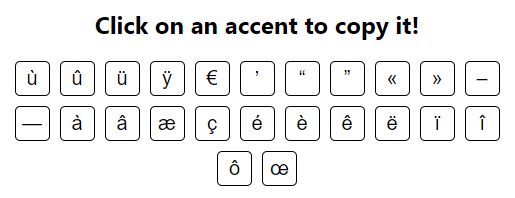
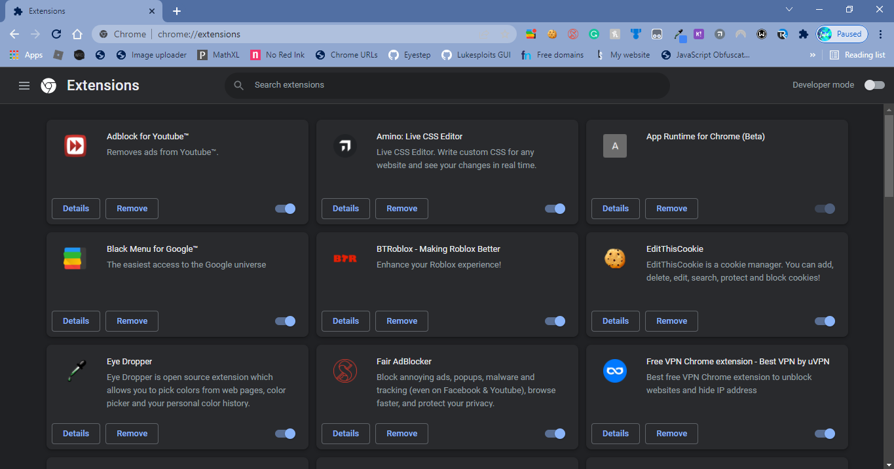
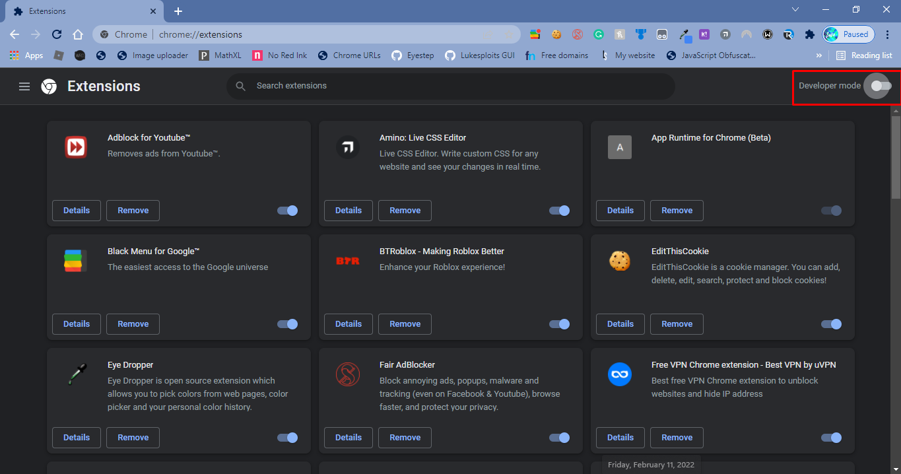
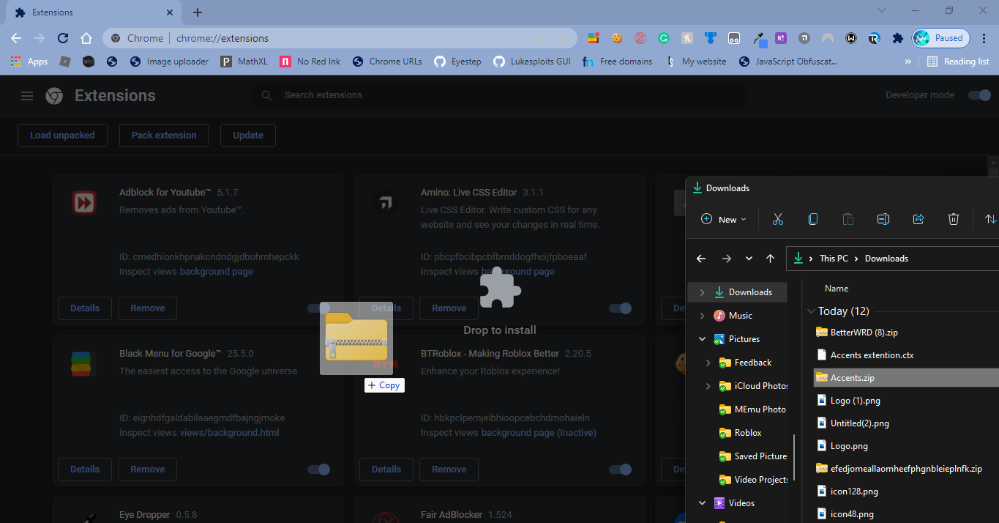

# French accents

This extension allows you to copy French accents.

Shift-click to copy the capitalized accent. 

## In order to download this extension:

1. Download the zip file under "assets"
2. Go to chrome://extensions/

3. Turn on Developer mode

4. Reload the page
5. Drag the zip file to the extensions page

6. Enjoy!
